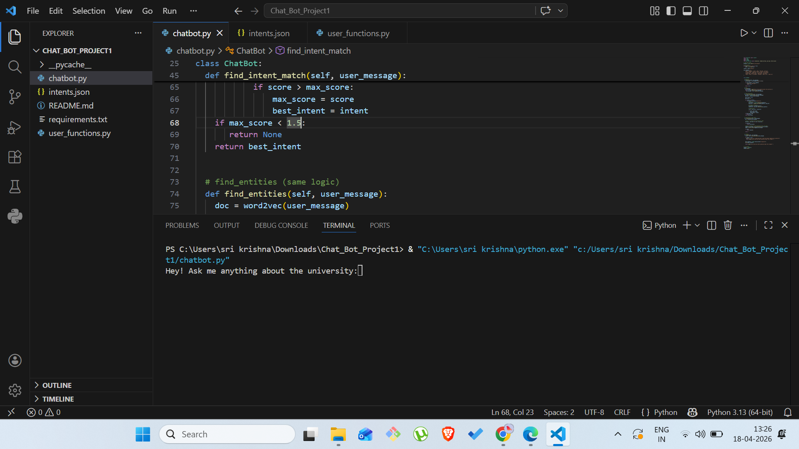
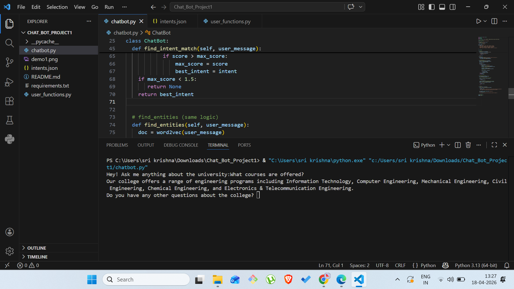
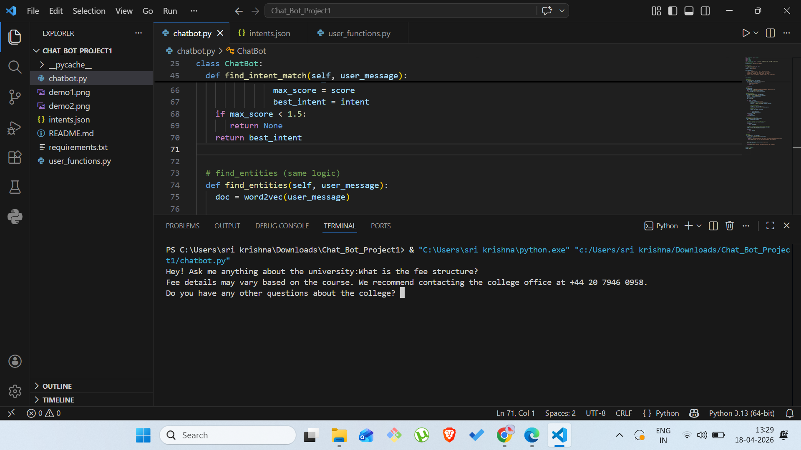
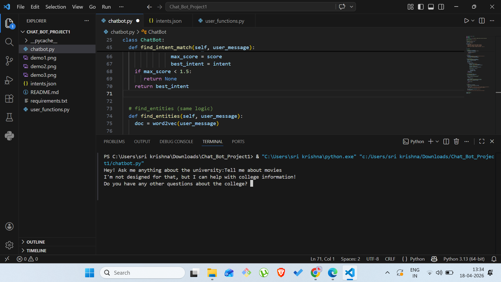
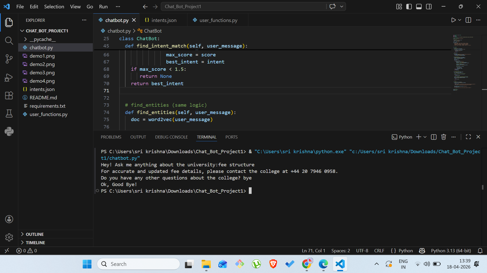

# University Chatbot (Retrieval-Based)

## Author
- Name: SRIKRISHNA SIDDALA
- Codecademy Username: SRIKRISHNASIDDALA

---

## Project Type
This is a **retrieval-based chatbot** designed to answer university-related queries.

### Why Retrieval-Based?
I chose a retrieval-based approach because:
- It provides **accurate and controlled responses**
- It is suitable for **closed-domain applications**
- It avoids generating incorrect or misleading answers

---

## Domain
This chatbot follows a **closed-domain architecture**, focused only on:
- College information
- Admissions
- Courses
- Facilities
- Placements

---

## Use Cases
- Students asking about courses, fees, and admissions
- Visitors looking for college information
- Quick automated support for common queries

---

## Techniques Used

- **Natural Language Processing (NLP)**
  - Tokenization (NLTK)
  - Stopword removal
  - POS tagging

- **Machine Learning Techniques**
  - Bag of Words (BoW)
  - Word2Vec (spaCy embeddings)

- **Intent Classification**
  - Hybrid approach (BoW + semantic similarity)

- **Entity Recognition**
  - Named Entity Recognition (spaCy)
  - Noun extraction (POS tagging)

- **Response Selection**
  - Predefined responses (retrieval-based)

---

## Dependencies

Install using:
```
pip install -r requirements.txt

```

---

- **Libraries Used**
  - Python 3.x
  - spaCy
  - NLTK
  - json
  - collections

---

**Setup**
```
python -m spacy download en_core_web_md

```
---

**Dataset**

The dataset used is a custom intents.json file containing:

  - Intents
  - Patterns
  - Responses

---

## Reflection
*Process*

I started by building a basic chatbot using pattern matching and gradually improved it by adding NLP techniques like Bag-of-Words and Word2Vec similarity.

*Challenges*
- Handling user queries with different phrasing
- Improving intent matching accuracy
- Implementing meaningful entity recognition

*Successes*
- Successfully combined BoW and Word2Vec for better accuracy
- Built a functional closed-domain chatbot
- Improved user experience with better responses

*Learnings*
- Importance of preprocessing in NLP
- Difference between keyword matching and semantic similarity
- How embeddings improve chatbot understanding

*Ethical Considerations*
- Avoiding misleading or incorrect responses
- Keeping chatbot responses limited to known domain
- Ensuring respectful and safe interaction

---
## How to Run

1. Clone this repository:
```
git clone https://github.com/srikrishna725/university-chatbot.git
```

2. Navigate to the project folder:
```
cd university-chatbot
```

3. Install dependencies:
```
pip install -r requirements.txt
```

4. Download the spaCy model:
```
python -m spacy download en_core_web_md
```

5. Run the chatbot:
```
python chatbot.py
```

6. Start interacting with the chatbot in the terminal.

---

---

## 📸 Demo / Screenshots

Below are some example interactions with the chatbot:

### 🔹 Greeting


### 🔹 Asking about courses


### 🔹 Asking about fees


### 🔹 Unknown question handling


### 🔹 Exit conversation


---
